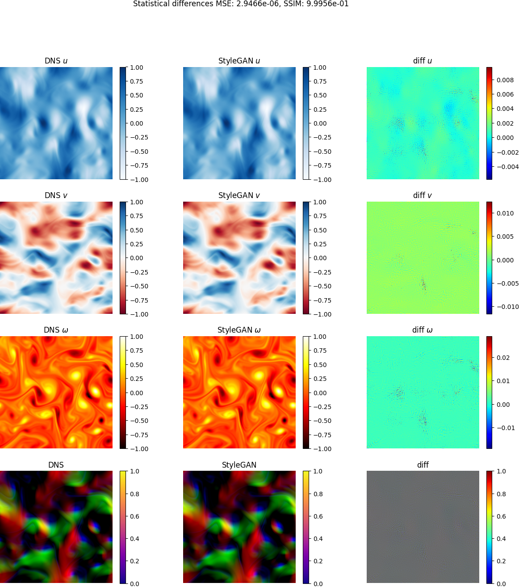

StylelES is a Style Eddy Simulation based solver for Computational Fluid Dynamic (CFD) simulations.
It is based on traditional LES solvers, like OpenFOAM, and Generative Adverserial Networks (GANs), mainly [SyleGAN](https://github.com/NVlabs/stylegan) and [MSG-Style GANs](https://github.com/akanimax/msg-stylegan-tf).

# Description
The purpose is to capture the Kolmogorov energy cascade training a StyleGAN via Direct Numerical Simulation (DNS). We then extract the Subgrid-Scale model for the LES.

# Requirements
We use TensorFlow 2.2 via conda. We suggest to innstall conda 4.8.3 (or above) and the
requirements creating a conda enviroment as follows (change the myenv name as you wish):

conda create -n myenv --file package-list.txt

For the GPU version, make sure you have the following requirements:

- NVIDIA GPU drivers —> CUDA 10.1 requires 418.x or higher.

# Testloop
The following results are obtained via these steps

1) Generate training DNS data using the staggered solver:
 - *python LES_solver_staggered.py* (from **LES_Solvers** folder. This will take ~5h)

2) Train the StyleGAN
 - *python main.py* (from **root** folder). This will take ~3h and the training should looks like those in the log file reference (open with TensorBoard). The following divergence values are obtained:

Total divergencies, dUdt and dVdt for each resolution:
   4x   4:   1.731917e-05   6.164761e-05   1.462779e-05\
   8x   8:   5.388206e-05   8.607486e-05   6.450627e-05\
  16x  16:   4.962974e-05   4.354246e-05   4.050047e-05\
  32x  32:   7.886339e-05   6.026323e-05   5.852895e-05\
  64x  64:   1.063415e-04   1.476900e-04   1.533099e-04\
 128x 128:   1.184308e-04   1.684770e-04   1.826820e-04\
 256x 256:   1.120220e-04   1.598327e-04   2.454020e-04

3) For a given DNS field, generate the matching field from the StyleGAN via search in the latent space
 - *python check_latentSpace* (from **utility** folder. This will take ~10min)

4) Compare results
 - *python compare_images.py* (from **utility** folder) 

