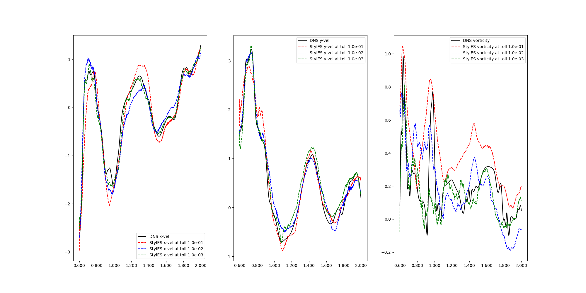

StylelES is a Style Eddy Simulation based solver for Computational Fluid Dynamic (CFD) simulations.
It is based on traditional LES solvers, like OpenFOAM, and Generative Adverserial Networks (GANs), mainly [SyleGAN](https://github.com/NVlabs/stylegan) and [MSG-Style GANs](https://github.com/akanimax/msg-stylegan-tf).


# Description
The purpose is to capture the Kolmogorov energy cascade training a StyleGAN via Direct Numerical Simulation (DNS). We then extract the Subgrid-Scale model for the LES.


# Requirements
We use TensorFlow 2.9 isntalled via pip (see https://www.tensorflow.org/install/pip). We suggest to create a pip enviroment as follows:

virtualenv tf_gpu_2.9\
source tf_gpu_2.9/bin/activate

For the GPU version, make sure you have the following requirements:

cudatoolkit=11.2\
cudnn=8.1.0

which you can easily install via conda.

You also need to download the TurboGenPY from https://github.com/saadgroup/TurboGenPY.git to find the energy spectra and use  Saad's initialization procedure for 2D-HIT. Once cloned (at same directory level of Styles) modify the files to obtaine the following git differences:

```
diff --git a/example2d.py b/example2d.py
index 937c5c4..daf63b4 100644
--- a/example2d.py
+++ b/example2d.py
@@ -87,7 +87,7 @@ if m:
        print(m)
 
 
-# specify which spectrum you want to use. Options are: cbc_spec, vkp_spec, and power_spec
+# specify which spectrum you want to use. Options are: cbc_spec, vkp_spec, power_spec and ld
 inputspec = 'cbc'
 if args.spectrum:
        inputspec = args.spectrum
@@ -96,8 +96,8 @@ if args.spectrum:
 fileappend = inputspec + '_' + str(nx) + '.' + str(ny) + '_' + str(nmodes) + '_modes'
 
 print('input spec', inputspec)
-if inputspec != 'cbc' and inputspec != 'vkp' and inputspec != 'kcm':
-       print('Error: ', inputspec, ' is not a supported spectrum. Supported spectra are: cbc, vkp, and power. Please revise your input.')
:...skipping...
diff --git a/example2d.py b/example2d.py
index 937c5c4..daf63b4 100644
--- a/example2d.py
+++ b/example2d.py
@@ -87,7 +87,7 @@ if m:
        print(m)
 
 
-# specify which spectrum you want to use. Options are: cbc_spec, vkp_spec, and power_spec
+# specify which spectrum you want to use. Options are: cbc_spec, vkp_spec, power_spec and ld
 inputspec = 'cbc'
 if args.spectrum:
        inputspec = args.spectrum
@@ -96,8 +96,8 @@ if args.spectrum:
 fileappend = inputspec + '_' + str(nx) + '.' + str(ny) + '_' + str(nmodes) + '_modes'
 
 print('input spec', inputspec)
-if inputspec != 'cbc' and inputspec != 'vkp' and inputspec != 'kcm':
-       print('Error: ', inputspec, ' is not a supported spectrum. Supported spectra are: cbc, vkp, and power. Please revise your input.')
+if inputspec != 'cbc' and inputspec != 'vkp' and inputspec != 'kcm' and inputspec != 'ld':
+       print('Error: ', inputspec, ' is not a supported spectrum. Supported spectra are: cbc, vkp, power and ld. Please revise your input.')
        exit()
 inputspec += '_spectrum'
 # now given a string name of the spectrum, find the corresponding function with the same name. use locals() because spectrum functions are defined in this module.
@@ -144,7 +144,7 @@ dx = lx / nx
 dy = ly / ny
 
 t0 = time.time()
-u, v = isoturb.generate_isotropic_turbulence(lx, ly, nx, ny, nmodes, wn1, whichspec)
+u, v = isoturb.generate_isotropic_turbulence_2d(lx, ly, nx, ny, nmodes, wn1, whichspec)
 t1 = time.time()
 elapsed_time = t1 - t0
 print('it took me ', elapsed_time, 's to generate the isotropic turbulence.')
@@ -186,7 +186,7 @@ if computeMean:
 #     print('cells with divergence: ', count)
 
 # verify that the generated velocities fit the spectrum
-knyquist, wavenumbers, tkespec = compute_tke_spectrum2d(u, v, lx, ly, False)
+knyquist, wavenumbers, tkespec = compute_tke_spectrum2d(u, v, lx, ly, True)
 # save the generated spectrum to a text file for later post processing
 np.savetxt('tkespec_' + fileappend + '.txt', np.transpose([wavenumbers, tkespec]))
 
@@ -251,7 +251,7 @@ wnn = np.arange(wn1, 2000)
 l1, = plt.loglog(wnn, whichspec(wnn), 'k-', label='input')
 l2, = plt.loglog(wavenumbers[1:6], tkespec[1:6], 'bo--', markersize=3, markerfacecolor='w', markevery=1, label='computed')
 plt.loglog(wavenumbers[5:], tkespec[5:], 'bo--', markersize=3, markerfacecolor='w', markevery=4, label='computed')
-plt.axis([8, 10000, 1e-7, 1e-2])
+plt.axis([6.283, 6283, 1e-12, 1e-0])
 # plt.xticks(fontsize=12)
 # plt.yticks(fontsize=12)
 plt.axvline(x=knyquist, linestyle='--', color='black')
diff --git a/spectra.py b/spectra.py
index 23189d9..ce00273 100644
--- a/spectra.py
+++ b/spectra.py
@@ -91,3 +91,26 @@ class pq_spectrum:
     kke = k/ke
     espec = 16.0*uavg*uavg/ke * np.sqrt(2.0/np.pi) * pow(kke,4) * np.exp(-2.0*(kke)*(kke))
     return espec
+
+
+class ld_spectrum:
+  # # Implements the Lowe & Davidson spectrum (Re=240)
+  # def __init__(self):
+  #   # find max and min wave numbers
+  #   self.Q    = 1.0e-22
+  #   self.kp   = 100*2*np.pi
+
+  #   # find k and E
+  # def evaluate(self, k):
+  #   espec = self.Q*(k**8)*np.exp(-4*(k/self.kp)**2)
+  #   return espec
+
+  def __init__(self):
+    dalspec = np.loadtxt('testcases/HIT_2D/ld_spectrum_0te.txt')
+    kdal=dalspec[:,0]
+    edal=dalspec[:,1]
+    self.especf = interpolate.interp1d(kdal, edal,'linear', fill_value="extrapolate")
+    self.kmin = kdal[0]
+    self.kmax = kdal[len(kdal) - 1]
+  def evaluate(self,k):
+    return self.especf(k)
diff --git a/tkespec.py b/tkespec.py
index 76701e6..6296604 100644
--- a/tkespec.py
+++ b/tkespec.py
@@ -91,6 +91,13 @@ def compute_tke_spectrum_1d(u, lx, ly, lz, smooth):
 
     tke_spectrum = tke_spectrum / knorm
 
+    sumTke = 0.0e0
+    for k in range(nx-1):
+       sumTke = sumTke + tke_spectrum[k]*(wave_numbers[k+1] - wave_numbers[k])
+
+    print("Turbulent Kinetical energy is", sumTke)
+
+
     if smooth:
         tkespecsmooth = movingaverage(tke_spectrum, 5)  # smooth the spectrum
         tkespecsmooth[0:4] = tke_spectrum[0:4]  # get the first 4 values from the original data
@@ -246,7 +253,7 @@ def compute_tke_spectrum2d(u, v, lx, ly, smooth):
     k0y = 2.0 * pi / ly
 
     knorm = (k0x + k0y) / 2.0
-    print('knorm = ', knorm)
+    #print('knorm = ', knorm)
 
     kxmax = nx / 2
     kymax = ny / 2
@@ -262,7 +269,7 @@ def compute_tke_spectrum2d(u, v, lx, ly, smooth):
         for ky in range(-ny//2, ny//2-1):
                rk = sqrt(kx**2 + ky**2)
                k = int(np.round(rk))
-               tke_spectrum[k] += tkeh[kx, ky]
+               tke_spectrum[k] += tkeh[kx, ky].real
     tke_spectrum = tke_spectrum / knorm
 
     #  tke_spectrum = tke_spectrum[1:]
```

# Testloop
The following results are obtained via these steps

1) Generate training DNS data using the staggered solver:
 - *python LES_solver_staggered.py* (from **LES_Solvers** folder. This will take ~5h)

2) Train the StyleGAN
 - *python main.py* (from **root** folder). This will take ~3h and the training should looks like those in the log file reference (open with TensorBoard). The following divergence values are obtained:

Total divergencies, dUdt and dVdt for each resolution:

   4x4:   1.352050e-05   1.076936e-05   7.241851e-06\
   8x8:   2.094521e-05   1.327567e-05   1.137550e-05\
  16x16:   1.504386e-05   2.115973e-05   1.633091e-05\
  32x32:   1.041567e-05   2.319826e-05   1.999779e-05\
  64x64:   8.149820e-06   3.983107e-05   3.605839e-05\
 128x128:   8.008950e-06   8.170066e-05   7.299501e-05\
 256x256:   9.369563e-06   2.382440e-04   2.216053e-04

3) Generate new DNS field to use as target different from the training dataset

  &nbsp;&nbsp;&nbsp;&nbsp;&nbsp;&nbsp;&nbsp;&nbsp; 3.a) move the folder LES_Solvers/fields to LES_Solvers/fields_training to avoid the training fields being overwritten\
  &nbsp;&nbsp;&nbsp;&nbsp;&nbsp;&nbsp;&nbsp;&nbsp; 3.b) rename the file testcases/HIT_2D/HIT_2D_inference.py as testcases/HIT_2D/HIT_2D.py\
  &nbsp;&nbsp;&nbsp;&nbsp;&nbsp;&nbsp;&nbsp;&nbsp; 3.c) *python LES_solver_staggered.py* (from **LES_Solvers** folder. This will take ~2h)

4) Set the flag RANDOMIZED_NOISE=False (**parameters.py** file)

5) For a given DNS field (default is set to fields_run0_it6040.npz file), generate the matching field from the StyleGAN via search in the latent space
 - *python check_latentSpace* (from **utility** folder. This will take ~5min)

6) Compare results
 - *python compare_images.py* (from **utility** folder) 
Differences between real DNS field and generated by StyleGAN are in the image below (Plots_DNS_diff.png)
<br/>
<br/>
<br/>


7) Reconstruct results
- *python check_reconstruction.py* (from **utility** folder) 
Results of the reconstruction are in the image below (uvw_vs_time). This will take ~2h
<br/>
<br/>
<br/>



