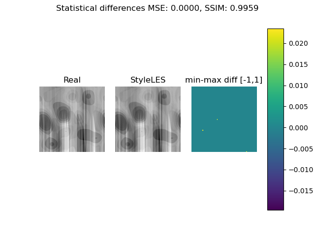
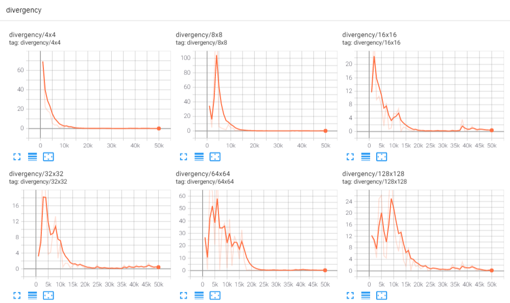

StyleLES is a Large Eddy Simulation (LES) based solver for Computational Fluid Dynamic (CFD) simulations.
It is based on traditional LES solvers, like OpenFOAM, and Generative Adverserial Networks (GANs), mainly [SyleGAN](https://github.com/NVlabs/stylegan) and [MSG-Style GANs](https://github.com/akanimax/msg-stylegan-tf).

# Description
The purpose is to capture the Kolmogorov energy cascade training a StyleGAN via Direct Numerical Simulation (DNS). We then extract the Subgrid-Scale model for the LES.

# Requirements
We use TensorFlow 2.2 via conda. We suggest to innstall conda 4.8.3 (or above) and the
requirements creating a conda enviroment as follows (change the myenv name as you wish):

conda create -n myenv --file package-list.txt

For the GPU version, make sure you have the following requirements:

- NVIDIA GPU drivers —> CUDA 10.1 requires 418.x or higher.

# Testloop
To run the testloop:

- python testloop/testloop.py

We have 2 tests:

#### 2D Homogeneous Isotropic Turbulence (2D-HIT) - single image
The test consists into reproducing a single 2D HIT image. The following results are expected:

#### Verify divergence
The test consists into reproducing a divergence-free flow 2D image. The following results are expected when opening the tensorboard (Crtl+Shift+p => Launch Tensorboard)

Divergence of 4x4:      7.861078e-03
Divergence of 8x8:      1.127832e-01
Divergence of 16x16:    2.354507e-01
Divergence of 32x32:    3.068304e-01
Divergence of 64x64:    1.681149e-03
Divergence of 128x128:  4.639959e-02

