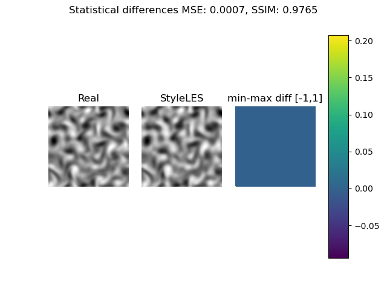

StyleLES is a Large Eddy Simulation (LES) based solver for Computational Fluid Dynamic (CFD) simulations.
It is based on traditional LES solvers, like OpenFOAM, and Generative Adverserial Networks (GANs), mainly [SyleGAN](https://github.com/NVlabs/stylegan) and [MSG-Style GANs](https://github.com/akanimax/msg-stylegan-tf).

# Description
The purpose is to capture the Kolmogorov energy cascade training a StyleGAN via Direct Numerical Simulation (DNS). We then extract the Subgrid-Scale model for the LES.

# Requirements
We use TensorFlow 2.2 via conda. We suggest to innstall conda 4.8.3 (or above) and the
requirements creating a conda enviroment as follows (change the myenv name as you wish):

conda create -n myenv --file package-list.txt

For the GPU version, make sure you have the following requirements:

- NVIDIA GPU drivers —> CUDA 10.1 requires 418.x or higher.

# Testloop
#### 2D Homogeneous Isotropic Turbulence (2D-HIT) - single image
This test consists into reproducing the same single 2D HIT image after training StyleLES. The following results are expected when running the solver after installing the conda enviroment as above and the following command lines

- python main.py
- python utilities.py

