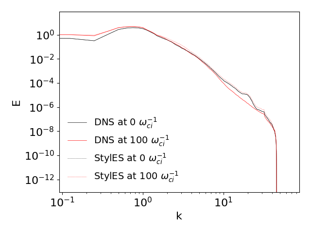

Style Eddy Simulation (StylES) is a reconstruction procedure of Direct Numerical Simulation (DNS) results from Large Eddy Simulation (LES).
It is based on traditional LES solvers and Generative Adverserial Networks (GANs), mainly [SyleGAN](https://github.com/NVlabs/stylegan) and [MSG-Style GANs](https://github.com/akanimax/msg-stylegan-tf).

 

# Description
The idea is to train StyleGAN on DNS data and then use the GAN generator as deconvolution operator for LES. More details are in the PASC23 ACM paper: **StyleGAN as Deconvolution operator for Large Eddy Simulation**.

 

# Requirements
We use TensorFlow >= 2.9 installed via pip (see https://www.tensorflow.org/install/pip). We suggest to create a virtual enviroment using the latest list of python module used, available in the **requirements.txt** file.

For the GPU version, make sure you have the following requirements:

cudatoolkit=11.2\
cudnn=8.1.0

which you can easily install via conda.

You will also need to download the TurboGenPY repo from https://github.com/saadgroup/TurboGenPY.git to find the energy spectra and use  Saad's initialization procedure for HIT_2D. Once cloned (at same directory level of StylES) modify the files using the patch file **patch_TurboGenPY.patch**.

 

# Testloop
The following results are obtained via these steps

1) Generate training DNS data using the staggered solver:
 - *python LES_solver_staggered.py* (from **LES_Solvers** folder. This will take ~3days!)

2) Train the StyleGAN
 - *python main.py* (from **root** folder). This will take ~24h and the training should looks like those in the log file reference (open with TensorBoard).

3) Generate new DNS fields to use as target different from the training dataset

  &nbsp;&nbsp;&nbsp;&nbsp;&nbsp;&nbsp;&nbsp;&nbsp; 3.a) create restart point using
  *python create_restart.py* (from **utility** folder). Change the SEED_RESTART to get a different field which can be seen in **LES_Solvers/plots_restart.png** (ideally you would like something which looks like the fields at $t=545 \tau_e$)\
  &nbsp;&nbsp;&nbsp;&nbsp;&nbsp;&nbsp;&nbsp;&nbsp; 3.b) run *python LES_solver_staggered.py HIT_2D_reconstruction* from **LES_Solvers** folder. This will take ~10min. **Carefull: previous fields files used for the training of the GAN will be overwritten!!**

4) Set the flag RANDOMIZED_NOISE=False (**parameters.py** file)

5) For a given DNS field (default is set to the last field produced during reconstruction, **fields_run0_it10001.npz**), generate the matching field from the StyleGAN via search in the latent space
 - *python check_latentSpace* (from **utility** folder. This will take ~1h due to the low tollerance set)

6) Compare results
 - *python compare_images.py* (from **utility** folder) 
Differences between real DNS field and generated by StyleGAN are in the image below (Plots_DNS_diff.png)
 
 
 

7) Reconstruction results
- *python check_reconstruction.py* (from **utility** folder) 
Results of the reconstruction are in the image below (uvw_vs_time). This will take ~30min. Results are below
 
 
 

Reconstruction vs time at different tolerances:

Profile reconstructed at initial and final time:

Energy spectra at initial and final time:

# Copyright
Copyright (C): 2023 UKRI-STFC (Hartree Centre)

Author: Jony Castagna, Francesca Schiavello

Licence: This program is free software: you can redistribute it and/or modify
it under the terms of the GNU General Public License as published by
the Free Software Foundation, either version 3 of the License, or
(at your option) any later version.

This program is distributed in the hope that it will be useful,
but WITHOUT ANY WARRANTY; without even the implied warranty of
MERCHANTABILITY or FITNESS FOR A PARTICULAR PURPOSE.  See the
GNU General Public License for more details.

You should have received a copy of the GNU General Public License
along with this program.  If not, see [GNU-licence](https://www.gnu.org/licenses/).
