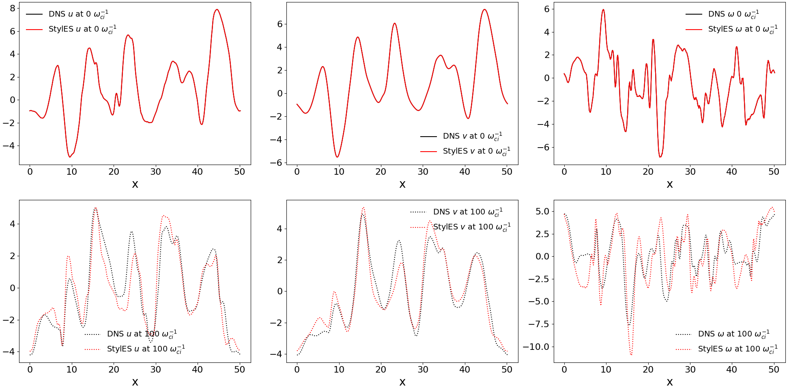

StylelES is a Style Eddy Simulation based solver for Computational Fluid Dynamic (CFD) simulations.
It is based on traditional LES solvers, like OpenFOAM, and Generative Adverserial Networks (GANs), mainly [SyleGAN](https://github.com/NVlabs/stylegan) and [MSG-Style GANs](https://github.com/akanimax/msg-stylegan-tf).

# Description
The purpose is to capture the Kolmogorov energy cascade training a StyleGAN via Direct Numerical Simulation (DNS). We then extract the Subgrid-Scale model for the LES.

# Requirements
We use TensorFlow 2.9 isntalled via pip (see https://www.tensorflow.org/install/pip). We suggest to create a pip enviroment as follows:

virtualenv tf_gpu_2.9\
source tf_gpu_2.9/bin/activate

For the GPU version, make sure you have the following requirements:

cudatoolkit=11.2\
cudnn=8.1.0

which you can easily install via conda.

You also need to download the TurboGenPY from https://github.com/saadgroup/TurboGenPY.git to find the energy spectra and use  Saad's initialization procedure for HIT_2D. Once cloned (at same directory level of Styles) modify the files using the patch file *patch_TurboGenPY.patch* as follows

- *patch -p1 -i ../StylES/patch_TurboGenPY.patch* (from TurboGenPY **root** folder).

# Testloop
The following results are obtained via these steps

1) Generate training DNS data using the staggered solver:
 - *python LES_solver_staggered.py* (from **LES_Solvers** folder. This will take ~5h)

2) Train the StyleGAN
 - *python main.py* (from **root** folder). This will take ~24h and the training should looks like those in the log file reference (open with TensorBoard). The following divergence values are obtained:

Total divergencies, dUdt and dVdt for each resolution:

   4x4:   1.352050e-05   1.076936e-05   7.241851e-06\
   8x8:   2.094521e-05   1.327567e-05   1.137550e-05\
  16x16:   1.504386e-05   2.115973e-05   1.633091e-05\
  32x32:   1.041567e-05   2.319826e-05   1.999779e-05\
  64x64:   8.149820e-06   3.983107e-05   3.605839e-05\
 128x128:   8.008950e-06   8.170066e-05   7.299501e-05\
 256x256:   9.369563e-06   2.382440e-04   2.216053e-04

3) Generate new DNS field to use as target different from the training dataset

  &nbsp;&nbsp;&nbsp;&nbsp;&nbsp;&nbsp;&nbsp;&nbsp; 3.a) create restart point using
  *python create_restart.py* (from **utility** folder. Change the SEED_RESTART to get a different field)\
  &nbsp;&nbsp;&nbsp;&nbsp;&nbsp;&nbsp;&nbsp;&nbsp; 3.b) move the folder LES_Solvers/fields to LES_Solvers/fields_training to avoid the training fields being overwritten\
  &nbsp;&nbsp;&nbsp;&nbsp;&nbsp;&nbsp;&nbsp;&nbsp; 3.c) rename the file testcases/HIT_2D/HIT_2D_reconstruction.py as testcases/HIT_2D/HIT_2D.py\
  &nbsp;&nbsp;&nbsp;&nbsp;&nbsp;&nbsp;&nbsp;&nbsp; 3.d) *python LES_solver_staggered.py* (from **LES_Solvers** folder. This will take ~2h)

4) Set the flag RANDOMIZED_NOISE=False (**parameters.py** file)

5) For a given DNS field (default is set to fields_run0_it6040.npz file), generate the matching field from the StyleGAN via search in the latent space
 - *python check_latentSpace* (from **utility** folder. This will take ~4h)

6) Compare results
 - *python compare_images.py* (from **utility** folder) 
Differences between real DNS field and generated by StyleGAN are in the image below (Plots_DNS_diff.png)
 
 
 

7) Reconstruction results
- *python check_reconstruction.py* (from **utility** folder) 
Results of the reconstruction are in the image below (uvw_vs_time). This will take ~1h. Results are below
 
 
 

Reconstruction vs time at different tolerances:

Profile reconstructed at initial and final time:

Energy spectra at initial and final time:

